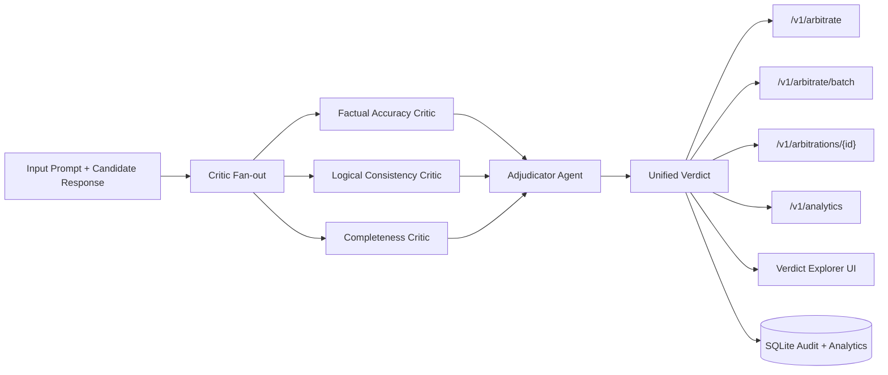

# LLM Output Arbitration System

<p align="center">
  
</p>

<p align="center">
  <a href="https://franck-asket-llm-output-arbitration-api.hf.space">
    
  </a>
  <a href="https://franck-asket-llm-output-arbitration-api.hf.space/docs">
    
  </a>
  
  
</p>

## Live App

- **Hugging Face Space:** [franck-asket/llm-output-arbitration-api](https://franck-asket-llm-output-arbitration-api.hf.space)
- **Interactive API Docs:** [Swagger UI](https://franck-asket-llm-output-arbitration-api.hf.space/docs)
- **Health Check:** [GET /health](https://franck-asket-llm-output-arbitration-api.hf.space/health)

## Architecture



Multi-agent arbitration pipeline that critiques a candidate LLM response with
specialized evaluators, then synthesizes those critiques into a confidence-based
verdict.

## What This Includes

- FastAPI service with a production-style API shape.
- Three critic roles:
  - Factual Accuracy Critic
  - Logical Consistency Critic
  - Completeness Critic
- Strict, typed output models using Pydantic.
- SQLite + SQLAlchemy audit logging of requests and final verdicts.
- OpenRouter-backed critic calls for factual/logical/completeness evaluation.
- Deterministic fallback heuristics so the system still runs without API keys.

## Tech Stack

- Python 3.11+
- FastAPI
- Pydantic v2
- SQLAlchemy
- pytest
- OpenRouter (LLM gateway)

The architecture remains provider-agnostic at the critic interface while using
OpenRouter as the Phase 2 execution layer.

## Quick Start

1. Create and activate a virtual environment:

   ```bash
   python3 -m venv .venv
   source .venv/bin/activate
   ```

2. Install dependencies:

   ```bash
   pip install -e ".[dev]"
   ```

3. Configure environment variables:

   ```bash
   export OPENROUTER_API_KEY="your_openrouter_api_key"
   export OPENROUTER_MODEL_FACTUAL="openai/gpt-4o-mini"
   export OPENROUTER_MODEL_LOGICAL="openai/gpt-4o-mini"
   export OPENROUTER_MODEL_COMPLETENESS="openai/gpt-4o-mini"
   export CORS_ALLOW_ORIGINS="*"
   ```

   Optional metadata headers:

   ```bash
   export OPENROUTER_APP_NAME="llm-output-arbitration-system"
   export OPENROUTER_SITE_URL="https://your-project-url.example"
   ```

4. Run the API:

   ```bash
   uvicorn app.main:app --reload
   ```

5. Open docs:

   - [http://127.0.0.1:8000/docs](http://127.0.0.1:8000/docs)

## API Usage

`POST /arbitrate`

```json
{
  "prompt": "Explain why the sky appears blue.",
  "candidate_response": "The sky is blue because shorter wavelengths scatter more than longer wavelengths."
}
```

If `API_ACCESS_KEY` is configured, include header:

```http
X-API-Key: <your_api_key>
```

Response includes:

- Structured critiques per critic role
- Confidence score (0-1)
- Label (`pass`, `review`, `fail`)
- Final synthesized reasoning

If `OPENROUTER_API_KEY` is missing (or an upstream call fails), the service
automatically falls back to local heuristic critics.

`POST /arbitrate/trace`

Returns the same verdict plus per-critic execution metadata:

- model used
- source (`openrouter`, `fallback_no_key`, `fallback_error`)
- latency in ms
- fallback error (if any)

## Phase 3-6 Additions

- Adjudicator-backed verdict resolution with disagreement analysis:
  - confirmed issues with evidence
  - dismissed flags with overrule reasoning
  - confidence level and 1-10 quality score
- New versioned API routes:
  - `POST /v1/arbitrate`
  - `POST /v1/arbitrate/batch`
  - `GET /v1/arbitrations/{id}`
  - `GET /v1/analytics`
- Verdict Explorer upgrades in Streamlit:
  - annotated output view
  - critic side-by-side comparison panel
  - batch mode table
- `docker-compose.yml` for full local stack:
  - API service
  - Ollama service for local model-backed completeness path

## Portfolio Test Cases

Run the four showcase cases (factually wrong, logically flawed, misses point, good response):

```bash
python scripts/run_portfolio_cases.py
```

Generated artifacts:

- `artifacts/portfolio_cases/portfolio_results_*.json`
- `artifacts/portfolio_cases/portfolio_summary_*.md`

Public call example:

```bash
curl -X POST "https://your-deployed-api.example/arbitrate" \
  -H "Content-Type: application/json" \
  -d '{
    "prompt":"Explain why the sky appears blue.",
    "candidate_response":"The sky appears blue because shorter wavelengths of sunlight scatter more in the atmosphere."
  }'
```

## Deploy Online (Public API)

### Option 1: Render (fastest)

1. Push this repo to GitHub.
2. In Render, create a **New Web Service** from the repo.
3. Render auto-detects `render.yaml` and Docker build.
4. Set required env vars in Render dashboard:
   - `OPENROUTER_API_KEY` (required for LLM critics)
   - `OPENROUTER_SITE_URL` (optional but recommended)
   - `API_ACCESS_KEY` (recommended to protect public endpoints)
5. Deploy and use:
   - `https://<your-render-service>.onrender.com/docs`
   - `https://<your-render-service>.onrender.com/arbitrate`

### Option 2: Any Docker host (Railway, Fly.io, ECS, VM)

```bash
docker build -t llm-arbitration-api .
docker run -p 8000:8000 \
  -e OPENROUTER_API_KEY="your_key" \
  -e CORS_ALLOW_ORIGINS="*" \
  llm-arbitration-api
```

Then expose the container URL publicly and call `/arbitrate` from any app.

Run full local stack with Ollama:

```bash
docker compose up --build
```

### Option 3: Hugging Face Spaces (Docker)

1. Create a new **Docker Space** on Hugging Face.
2. Connect this GitHub repo (or push this code into the Space repo).
3. In Space settings, add secrets/variables:
   - `OPENROUTER_API_KEY` (required)
   - `CORS_ALLOW_ORIGINS=*`
   - `DATABASE_URL=sqlite:////data/arbitration.db` (recommended with persistent storage)
   - `API_ACCESS_KEY=<your_secret_key>` (recommended)
4. (Recommended) Enable persistent storage in the Space so history remains available.
5. Deploy. Your API will be available at:
   - `https://<space-name>.hf.space/health`
   - `https://<space-name>.hf.space/docs`
   - `https://<space-name>.hf.space/arbitrate`

You can use `HF_SPACE_README.md` as the Space root `README.md` template when
publishing directly to a dedicated Space repository.

## Production Notes

- `CORS_ALLOW_ORIGINS` supports comma-separated values, e.g. `https://app1.com,https://app2.com`.
- Keeping `CORS_ALLOW_ORIGINS=*` is easiest for public API access.
- Set `API_ACCESS_KEY` to enforce `X-API-Key` checks on `/arbitrate` and `/arbitrate/trace`.
- Built-in per-IP limiter can be enabled with:
  - `RATE_LIMIT_REQUESTS` (e.g. `60`)
  - `RATE_LIMIT_WINDOW_SECONDS` (e.g. `60`)
- Default `RATE_LIMIT_REQUESTS=0` keeps limiter disabled.
- Rate-limited endpoints return headers:
  - `X-RateLimit-Limit`
  - `X-RateLimit-Remaining`
  - `X-RateLimit-Window-Seconds`
  - `Retry-After` (when blocked with `429`)

## UI (Streamlit)

Run the API first:

```bash
uvicorn app.main:app --reload
```

In another terminal, launch the UI:

```bash
streamlit run ui/streamlit_app.py
```

The UI lets you:

- submit prompt + candidate response
- choose `arbitrate` or `arbitrate/trace`
- inspect verdict, per-critic issues, and trace telemetry
- view raw JSON output for debugging

## Project Structure

- `app/main.py` - FastAPI app and routes.
- `app/arbitrator.py` - Orchestration + synthesis logic.
- `app/critics.py` - LLM-backed critics + heuristic fallback logic.
- `app/openrouter.py` - OpenRouter chat completions client.
- `app/config.py` - Environment-driven runtime settings.
- `app/schemas.py` - Typed request/response models.
- `app/storage.py` - SQLite persistence and audit logs.
- `tests/test_arbitrator.py` - Baseline behavior tests.
- `ui/streamlit_app.py` - Streamlit verdict explorer.

## Run Tests

```bash
pytest -q
```
